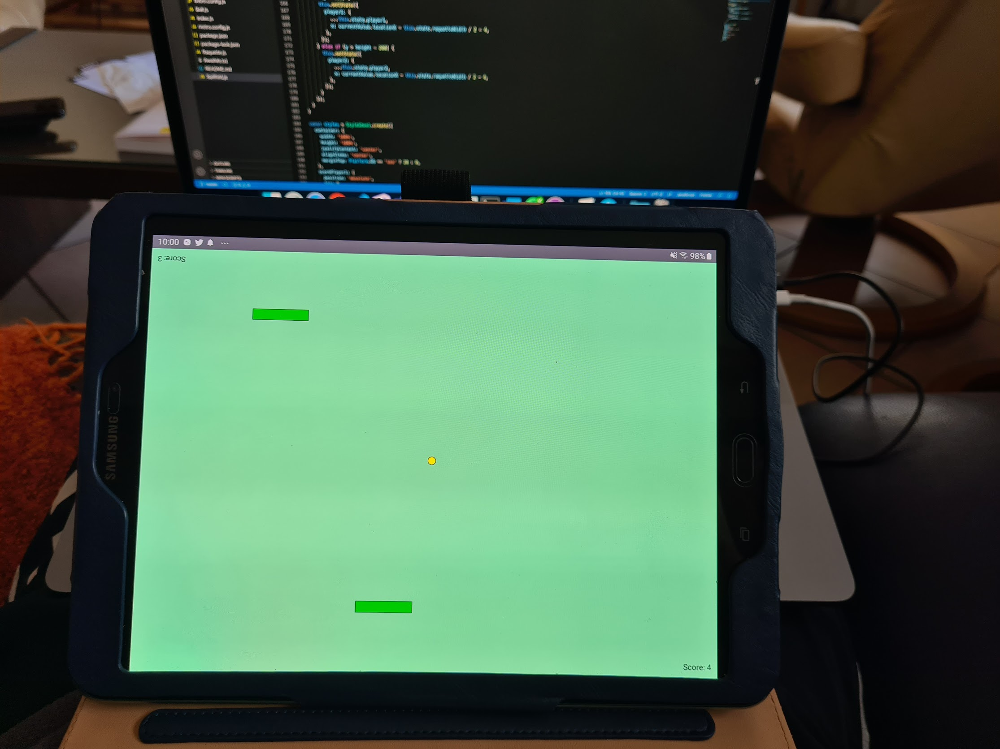

# retro-tetris

## Introduction 

t my former employer I had to take care of a motivated student (9th grade)

After showing him low level database optimisations with in-memory tables and some boring reporting I had to automate, I decided to create from scratch a game in 4 hours with him together, a cross-platform multiplayer game he could take home and show his friends and family 😊

Notice the Luxembourgish names of the components to enhance comprehension.

https://www.instagram.com/p/CDgBsXqnTdp/?utm_source=ig_web_button_share_sheet

## Enjoy

